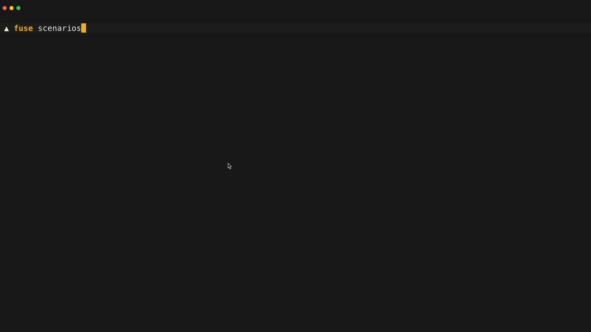

## Installation

Select tab depending on the system you use:

import Tabs from "@theme/Tabs";
import TabItem from "@theme/TabItem";

<Tabs groupId="cli">
<TabItem value="macos-arm64" label="Mac with Apple Silicon" default>

Use <a href="https://brew.sh" target="_blank" rel="noreferrer">Homebrew</a> to install the latest version of the Fuse CLI:

```shell
brew install kubeshop/fuse-releases/fuse
```

Upgrade the existing installation with:

```shell
brew upgrade kubeshop/fuse-releases/fuse
```

<hr />

Alternatively, download the version of the Fuse CLI binary and move it to a directory under your `$PATH`:

```shell
curl -Lo fuse https://github.com/kubeshop/fuse-releases/releases/latest/download/fuse-darwin-arm64
chmod +x fuse && mv fuse /usr/local/bin/fuse
```

</TabItem>

<TabItem value="macos-amd64" label="Mac with Intel chip" default>

Use <a href="https://brew.sh" target="_blank" rel="noreferrer">Homebrew</a> to install the latest version of the Fuse CLI:

```shell
brew install kubeshop/fuse/fuse
```

<hr />

Alternatively, download the version of the Fuse CLI binary and move it to a directory under your `$PATH`:

```shell
curl -Lo fuse https://github.com/kubeshop/fuse-releases/releases/latest/download/fuse-darwin-amd64
chmod +x fuse && mv fuse /usr/local/bin/fuse
```

</TabItem>

<TabItem value="linux" label="Linux">

Download the version of the Fuse CLI binary and move it to a directory under your `$PATH`:

```shell
export ARCH=<your-arch> # allowed values: amd64, arm64, 386
curl -Lo fuse https://github.com/kubeshop/fuse-releases/releases/latest/download/fuse-linux-${ARCH}
chmod +x fuse && mv fuse /usr/local/bin/fuse
```

:::note
You may need to use `sudo` to run the `mv` command as it moves the binary file to the `/usr/local/bin/` directory.
:::

<hr />

Alternatively, if you use <a href="https://brew.sh" target="_blank" rel="noreferrer">Homebrew</a>, you can use it to install the latest version of the Fuse CLI:

```shell
brew install kubeshop/fuse-releases/fuse
```

Upgrade the existing installation with:

```shell
brew upgrade kubeshop/fuse-releases/fuse
```

</TabItem>

<TabItem value="windows" label="Windows">

Use <a href="https://curl.se/windows/" target="_blank" rel="noreferrer">curl</a> to download the version of the Fuse CLI binary:

```shell
curl -Lo fuse https://github.com/kubeshop/fuse-releases/releases/latest/download/fuse-windows-amd64.exe
```

Move the binary to a directory under your `%PATH%`.

</TabItem>

<TabItem value="other" label="Other">

Use <a href="https://curl.se" target="_blank" rel="noreferrer">curl</a> to download the version of the Fuse CLI binary:

```shell
export OS=<your-os> # allowed values: darwin, linux, windows
export ARCH=<your-arch> # allowed values: amd64, arm64, 386
export SUFFIX="" # set to ".exe" if OS is 'windows'
curl -Lo fuse https://github.com/kubeshop/fuse-releases/releases/latest/download/fuse-${OS}-${ARCH}${SUFFIX}
chmod +x fuse && mv fuse /usr/local/bin/fuse
```

Move the binary to a directory under your `$PATH` or `%PATH%`, depending on your operating system.

</TabItem>

</Tabs>

## Usage

After downloading the CLI, you can start experimenting right away!

### Chat mode

To start a session in chat mode, simply run:

```shell
fuse
```

:::note
Native text selection is disabled in chat mode. To select text, please use the following workaround:

- **For Linux:** Press and hold `Shift` while selecting text.
- **For macOS:** Press and hold `Option` while selecting text.
  :::

### Inline prompting

:::tip
When using inline mode, enclose your prompt in single quotation marks (') to prevent your shell from interpreting it.
:::

Fuse CLI also supports inline mode, allowing you to execute prompts directly. Run:

```shell
fuse 'list files in the current directory and provide me better organization structure'
```

### Looking for inspiration?

💡 If you are curious what Fuse can do for you, simply run `fuse scenarios` in your terminal!


