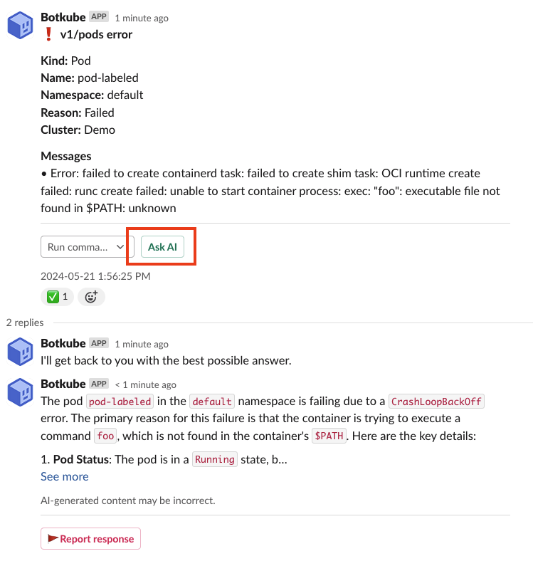

:::info

**AI Assistant is available as a part of the Botkube Cloud offering, with a usage quota depending on a selected plan.**

:::

## Introduction

The AI Assistant plugin makes it easier than ever for teams to identify, diagnose, and troubleshoot issues in any Kubernetes cluster. It is powered by the OpenAI GPT-4o large language model with additional Kubernetes-related capabilities.

## Features

The plugin provides the following features:

- "AI Help" button for Kubernetes event analysis.
- Answering arbitrary questions or instructions.
- Kubernetes cluster troubleshooting based on:
  - `kubectl` commands,
  - container logs,
  - Kubernetes events,
  - resource usage (CPU/memory).
- Answering Botkube questions or instructions based on:
  - Agent status and configuration,
  - the latest Botkube documentation and other Botkube content.
- Keeping conversation context in the message threads.

## How to enable the plugin

You can enable the plugin as a part of Botkube instance configuration.

1. If you don't have an existing Botkube instance, create a new one, according to the [Installation](../installation/index.mdx) docs.
2. From the [Botkube Cloud homepage](https://app.botkube.io), click on a card of a given Botkube instance.
3. Navigate to the platform tab which you want to configure.
4. Click **Add plugin** button.
5. Select the AI plugin.
6. Click **Save** button.

## Configuration options

Currently, the AI plugin doesn't have any configuration options.

## Usage

### AI Help

Click on the **AI Help** button to get an analysis of the event.

## Limitations

- The conversation context is stored in-memory and will be cleared on Botkube Agent restart.
