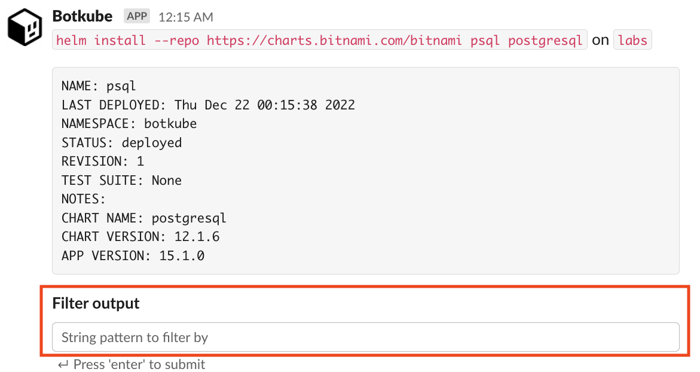

:::info
**This plugin is hosted by the [Botkube Cloud](https://app.botkube.io) plugin repository and requires active Botkube Cloud account.**
:::

The Helm executor plugin allows you to run the `helm` command directly in the chat platform.

The Helm plugin is hosted by the Botkube Cloud plugin repository and requires active Botkube Cloud account.

By default, just the read-only `helm` commands are supported. For enabling commands that require create, update or delete rules, you need to create specific (Cluster)Role and (Cluster)RoleBinding and reference it in the RBAC configuration. To learn more, refer to the [RBAC section](../rbac.md).

## How to enable the plugin

You can enable the plugin as a part of Botkube instance configuration.

1. If you don't have an existing Botkube instance, create a new one, according to the [Installation](../../installation/index.mdx) docs.
2. From the [Botkube Cloud homepage](https://app.botkube.io), click on a card of a given Botkube instance.
3. Navigate to the platform tab which you want to configure.
4. Click **Add plugin** button.
5. Select the Helm plugin.
6. Click **Save** button.

## Usage

To execute `helm` commands, send message in the following format in the channel where Botkube is already added:

```
@Botkube helm [command] [flags]
```

:::caution
Using the interactive filter input field causes the Helm command to be re-executed. Be careful when using it for read-write commands.



This issue is tracked in [botkube#907](https://github.com/kubeshop/botkube/issues/907).
:::

## Supported commands

The Helm executor plugin has the exact same syntax as the Helm CLI. However, not all commands and flags are supported. If an unsupported flag is specified, you will get a dedicated error, e.g:

```
The "--wait" flag is not supported by the Botkube Helm plugin. Please remove it.
```

Additionally, the following flag syntax is not supported:

- No whitespace between short flag name and its value. Instead of `-oyaml`, use `-o yaml`.
- Merging multiple short flags together. Instead of `-Aa`, use `-A -a`.

### Read-only commands

List of the read-only commands:

- `@Botkube helm help` - shows the general Helm plugin help message.
- `@Botkube helm list` - lists all releases on cluster where Botkube is installed.
  - The `--filter` flag is reserved by Botkube. As a result, to use the Helm filter functionality use `-f` instead, e.g. `helm list -f 'ara[a-z]+'`.
- `@Botkube helm status` - displays the status of the named release.
- `@Botkube helm version` - shows the version of the Helm CLI used by this Botkube plugin.

### Read-write commands

For the read-write commands the Botkube RBAC needs to be adjusted. For more information, see the [**Enabling plugin**](../../configuration/executor/helm.md#enabling-plugin) section.

List of the read-write commands:

- `@Botkube helm rollback` - rolls back a given release to a previous revision.
- `@Botkube helm test` - runs tests for a given release.
- `@Botkube helm uninstall` - uninstalls a given release.
- `@Botkube helm upgrade` - upgrades a given release.
- `@Botkube helm install` - installs a given chart to cluster where Botkube is installed. There are two different ways you to install a Helm chart:
  - By absolute URL: `helm install mynginx https://example.com/charts/nginx-1.2.3.tgz`
  - By chart reference and repository URL: `helm install --repo https://example.com/charts/ mynginx nginx`

## Configuration

The plugin supports the following configuration:

```yaml
# Configures the default Namespace for executing Botkube `helm` commands. If not set, uses 'default'.
defaultNamespace: "default"
# Allowed values are configmap, secret, memory.
helmDriver: "secret"
# Location for storing Helm configuration.
helmConfigDir: "/tmp/helm/"
config directory.
# Location for storing Helm cache.
helmCacheDir: "/tmp/helm/.cache"
```

## Merging strategy

For all collected `helm` executors bindings, configuration properties are overridden based on the order of the binding list for a given channel. The priority is given to the last binding specified on the list. Empty properties are omitted.
