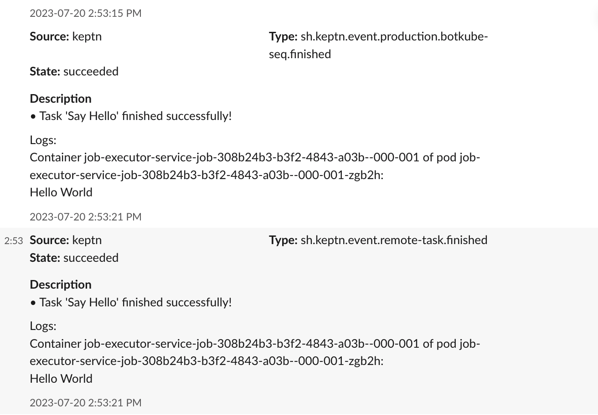

:::info

**This plugin is available as a part of the Botkube Cloud offering.**

Botkube is introducing new plugins with advanced functionality that will be part of the Botkube Team and Enterprise packages. These advanced plugins require cloud services provided by Botkube and are not part of the Botkube open source software.

As part of this change, some of the existing Botkube plugins are being moved to a new repository. This repository requires authentication with a Botkube account. To continue using these Botkube plugins, create an account at https://app.botkube.io/ and configure a Botkube instance, or [migrate an existing installation with the Botkube CLI](../cli/migrate.md).

:::

The Botkube Keptn source plugin allows you to consume events from Keptn deployment and notify in configured platforms.

The Keptn plugin is hosted by the Botkube Cloud plugin repository and requires active Botkube Cloud account.

## Enabling plugin

You can enable the plugin as a part of Botkube instance configuration.

1. If you don't have an existing Botkube instance, create a new one, according to the [Installation](../installation/index.mdx) docs.
2. From the [Botkube Cloud homepage](https://app.botkube.io), click on a card of a given Botkube instance.
3. Navigate to the platform tab which you want to configure.
4. Click **Add plugin** button.
5. Select the Keptn plugin.
6. Click **Save** button.

## Usage

Once it is enabled, Botkube Keptn plugin will consume Keptn events and send them to configured platforms as shown below.



## Configuration Syntax

This plugin supports the following configuration:

```yaml
# Keptn API Gateway URL.
url: "http://api-gateway-nginx.keptn.svc.cluster.local/api"
# Keptn API Token to access events through API Gateway.
token: ""
# Optional Keptn project.
project: ""
# Optional Keptn Service name under the project.
service: ""
# Logging configuration
log:
  # Log level
  level: info
```
